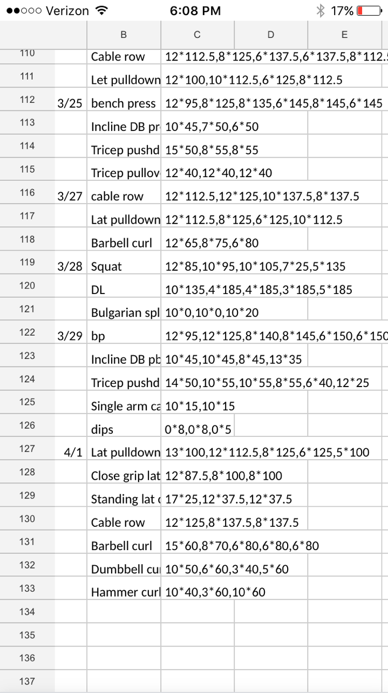

# Introduction

StatLifts is a data analysis pipeline that I developed in order to facilitate data science mediated optimization of my training. In my searches of apps and services, I could not find a resource that offered the following: 
- Outstandingly simple input on my phone in the gym.
- Easy access to graphs and tables in a clear and interpretable format for in the moment decision making regarding training decisions.

I eventually discovered that I could record my workouts in a simple fashion using google spreadsheets in the following format: 

This simply left the data pipeline to be developed in the way that I wanted. 

These notebooks are the result of my efforts. 

# Outputs

# Quickstart

#### Todo:

- Integrate old workout data
- Separate main notebook into munge and main
- Add volume calculations and figures
- Add workout function which displays all the lifts of a single workout and the last 5 of of those lifts (row = lift ; column = dates)
- Add gridplot indicating gym attendance with color weighted by volume
- Add date range functionality to graphing functions
- Add stats for workouts in time periods
- Add stats for total workouts, sets, reps
- Workouts by day of the week in box plots or bar graph

- Update readme with quickstart guide
- Add non-jupyter scripts to display scripts

- Add functionality for aerobic and 'other' activity
    max distance
    max time
    max speed
    max pace
    total distance
    total time
    
- Integrate a heart rate function
- Update requirements and environment
- Package as runnable script
- Consider integrating into web app/iOS app
- Consider adding workout time started and ended
- Consider adding set rest times